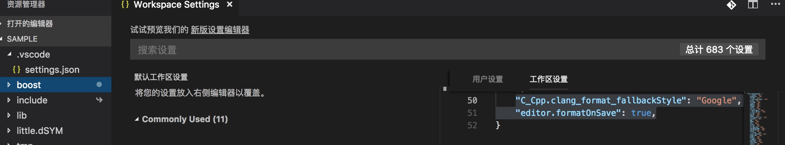

##编码规则
1.c++代码风格遵循google规范。
细节参照地址:
https://zh-google-styleguide.readthedocs.io/en/latest/google-cpp-styleguide/

2.函数以及变量命名遵循下划线(\_)风格。例如int my\_foo = 1;
##编码实战
1.风格需要侧重的细节颇多。在了解google规范后。一些格式化操作，必然还是存在漏洞的，为此建议使用ide自动format的能力来解决人力不足。

2.使用vscode

3.打开工程后，对应工程目录下点击.vscode.打开会有settings.json文件。在文件中黏贴如下内容:
"C_Cpp.clang_format_fallbackStyle": "Google",
"editor.formatOnSave": true,
语意是每次保存文件时会自动按照规则格式化代码。

如图:

    